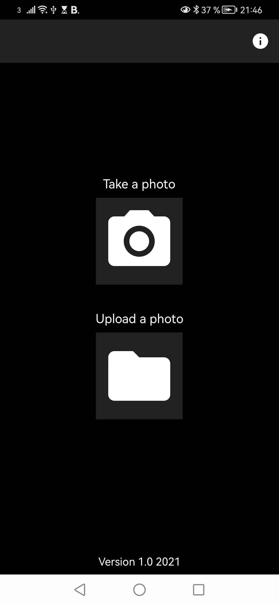
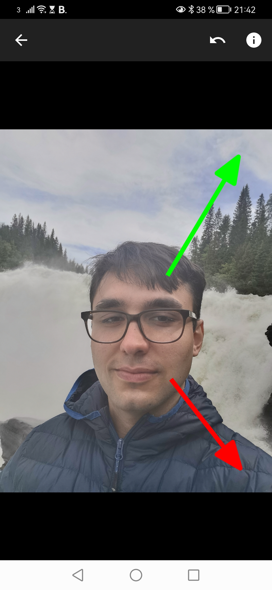

# Mobius-my-image
App made in Android studio that lets users take or upload a photo and apply möbius transformation to their image and save the result.

A möbius transformation is uniquely determined by a mapping of three points of the original image onto three points of the transformed image. Circles and lines are mapped to circles or lines.

Images of the UI of the app can be found below:

</img>
</img>
</img>

## Known bugs

- Whenever an image isn't selected or the app is rotated the current image is deleted and the previous image is shown. This could have unintended consequences for the user.
- If the image is the wrong size the app may show a blank image, lag and lock itself. Solution is to check the image size and resize accordingly.
